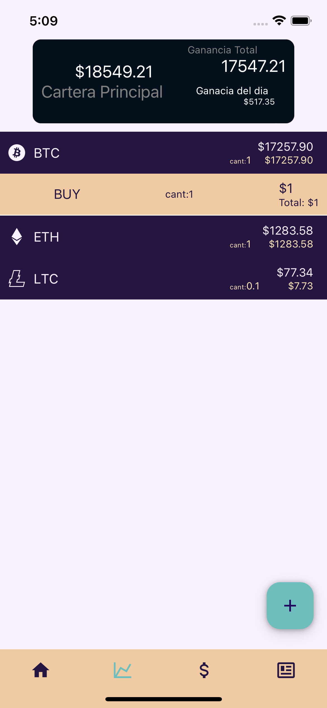
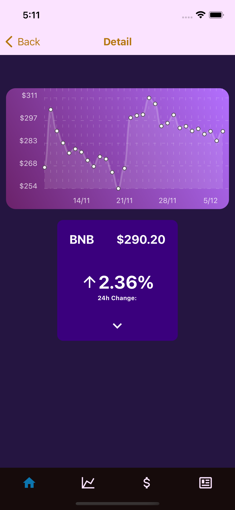

# c8-51-ft-typescript-react

Repositorio del grupo 51

# CrytoHub

Aplicación de utilidades de cryptomonedas construida con React Native y Typescript en Frontend, NodeJs, Express y MongoDB en Backend.

## Miembros

- [Gabriel Ruiz Varela](https://github.com/GabrielRuizVarela) - Fullstack Developer

### Deployment

#### iOS

[Link](exp://u.expo.dev/update/7a0e247f-5731-4d09-9190-55e8842ca0f6)

#### Android

[Link](exp://u.expo.dev/update/f7f1346c-824d-4de4-aa2a-dee29b22b12e)

# Screenshots
<!-- set the witdth to 50px an the height automatic -->

         